# Vulkan Renderer

Initially a university project to create a Vulkan renderer of the [Sun Temple](https://developer.nvidia.com/ue4-sun-temple) scene from [NVIDIA ORCA](https://developer.nvidia.com/orca), then further developed to implement various rendering techniques.

<video alt="preview_video" src="screenshots/updated_preview.mp4" controls></video>

## Features

### Forward and Deferred Rendering

The renderer employs both a forward and deferred rendering pipeline to allow for different lighting efficiency depending on scene.

Forward and deferred are implemented in the standard ways. Forward by rasterising and shading each lights contribution for each mesh of the scene as it gets processed, and deferred by writing to G-Buffers in one render pass and shading the remaining fragments in a second render pass, reducing overshading by not shading fragments that would be overwritten by other geometry.

The deferred pass utilises 3 G-Buffers and 1 depth buffer:
- G-Buffer 1: Contains normals sampled from the materials normal map.
    - Format: `VK_FORMAT_B10G11R11_UFLOAT_PACK32` to keep as much precision of the normal values using only 32 bits. Other formats can give more precision but uses more memory.
- G-Buffer 2: Contains material albedo colour and roughness value.
    - Format: `VK_FORMAT_R8G8B8A8_UNORM`, colours and roughness don't usually need more than 8 bits.
- G-Buffer 3: Contains emissive values and metalness value.
    - Format: `VK_FORMAT_R8G8B8A8_UNORM`, like above, these values don't typically need any more than 8 bits.
- Depth buffer: Stores depth of fragments.
    - Format: `VK_FORMAT_D32_SFLOAT`, since the world space position of fragments is reconstructed via the depth buffer in the fragment shader, using a high precision depth buffer allows for accurate shading in deferred.

Deferred pass therefore only uses 128 bits per pixel to pass data from the writing pass to the shading pass.

### Shadows

Integrated both Standard Shadow Mapping, utilising hardware PCF filtering using `Shadow` samplers in shaders, aswell as Variance Shadow Mapping to allow for softer shadow edges with an adjustable tap filter for the blurring stage. Shadows are implemented for point lights, directional lights, and spot lights. Each with their shadow map resolution being variable.

| Standard Shadow Mapping | Variance Shadow Mapping |
|---|---|
| 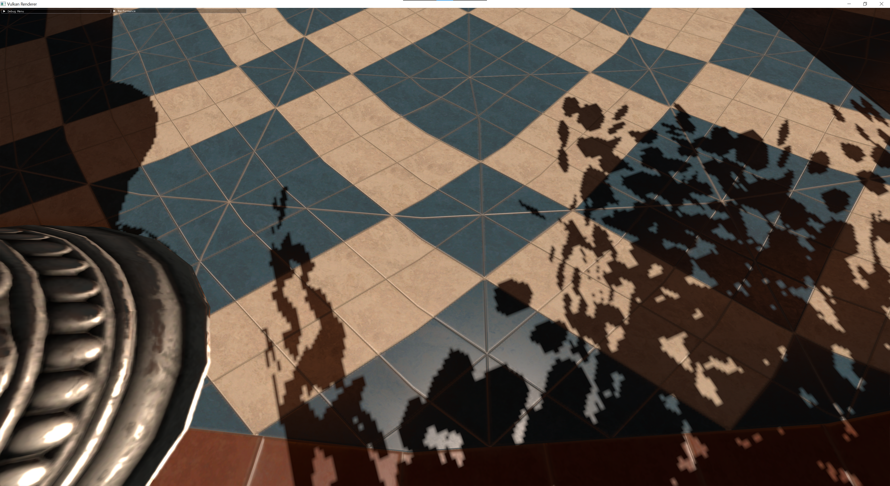 | 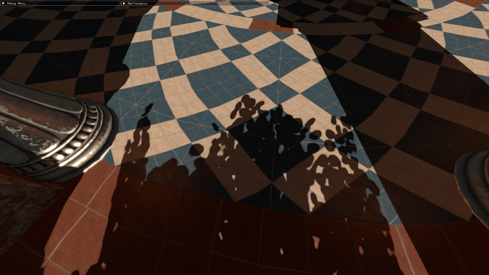 |
| 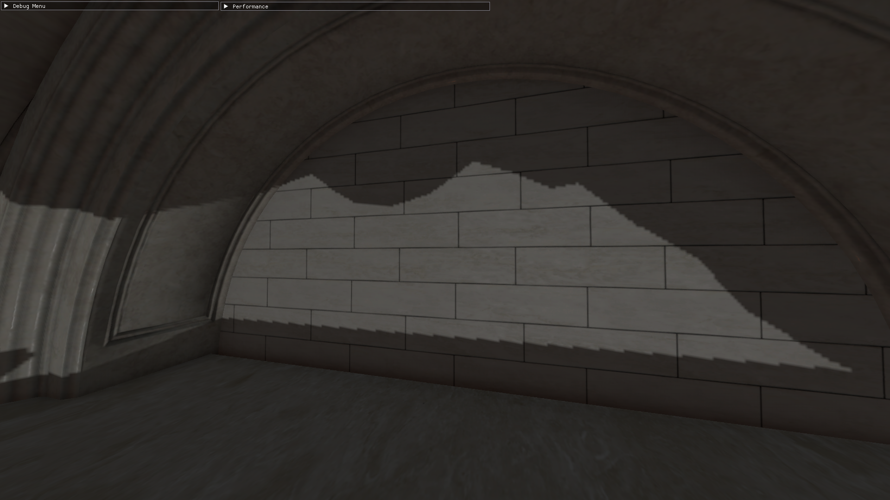 | 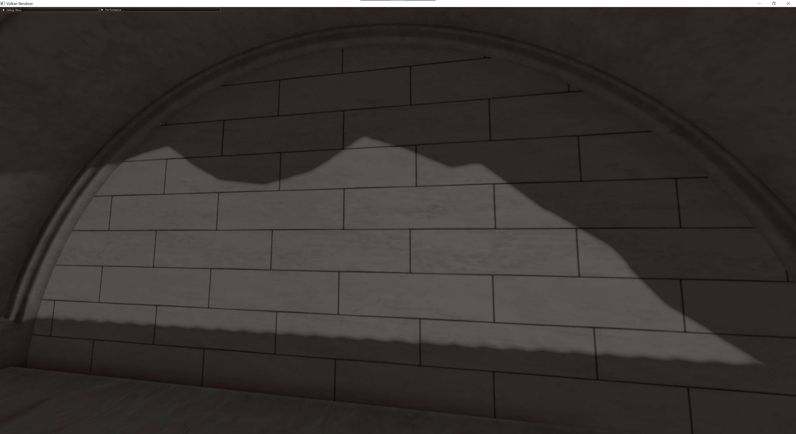 |

<b>Examples</b>

Directional and spot light shadow examples. Left: Shadows that occurred from a directional light, in this example the light being the sun. Right: Shadow that occurred from a spot light being placed in front of the statue (all other lights turned off to see better).

    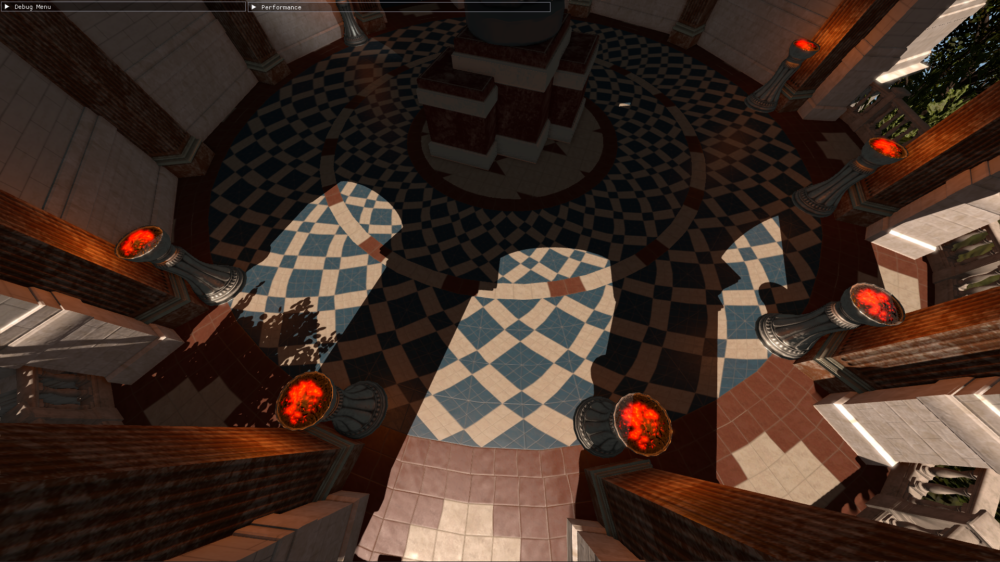
    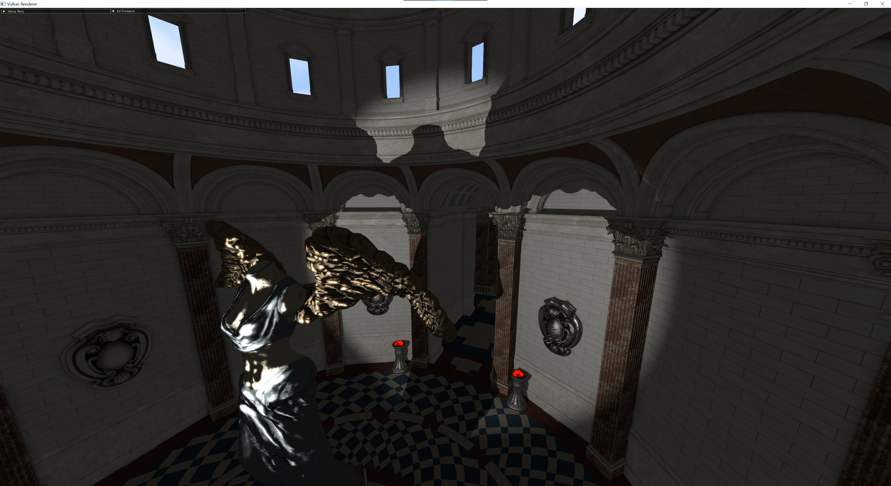

### Screen Space Ambient Occlusion (SSAO)

Screen Space Ambient Occlusion (SSAO) was also integrated into the renderer to allow for efficiently approximating the ambient occlusion within the scene in screen space.

Depending on whether forward or deferred rendering is enabled determines how SSAO is done. Since SSAO requires view-space normals and depth as inputs, and SSAO is needed *before* the shading stage, it plays itself to be nicely implemented in deferred by simply running it after the geometry stage and before the shading stage, since the geometry stage writes the depth and normals to a G-Buffer anyway.

If forward rendering is enabled, a 'pre-ssao' step is taken, in which the 1st G-Buffer that would be used in deferred is populated with view-space normals and the depth buffer is populated in order to be fed to the actual SSAO step[^1].

[^1]: Typically world space normals would be used in the 1st deferred G-Buffer or in the forward rendering fragment shaders, however since SSAO needs view-space normals a specialization constant is used in the shaders to determine whether to write / handle the normal as a view-space normal or world-space normal depending if SSAO is enabled.

Given the depth, view-space normals, and a 4x4 noise texture precomputed on initialisation, the SSAO implementation uses the [Gram-Schmidt process](https://en.wikipedia.org/wiki/Gram%E2%80%93Schmidt_process) to create an orthogonal basis of the view-space normal and a random normal from the noise texture, in order to create a TBN matrix to transform 32 kernel samples which are used to calculate the occlusion for that fragment.

After the occlusion is written to a texture of format `VK_FORMAT_R8_UNORM` it is blurred to hide the noise-y appearance due to using a 4x4 random noise texture and to have generally smooth ambient occlusions. When blurring the occlusion texture, edges of geometry which resulted in no occlusion can blur into edges of heavy occlusion and create a halo-ing effect around geometry where there should be ambient occlusion. To solve this a bilateral filter is used during the blurring process so large differences in depth and normals skip being blurred.

To improve performance the SSAO step is done at half resolution and then upscaled during the blurring stage. Since we use Gaussian blurring it is seperable and we can split the blur stage into a horizontal and vertical blur pass reducing the number of samples from $N^2$ to $2N$. We also can utilise bilinear texture filtering to get information about multiple pixels by not sampling at center of texel positions. More info about this can be found [here](https://www.rastergrid.com/blog/2010/09/efficient-gaussian-blur-with-linear-sampling/).

    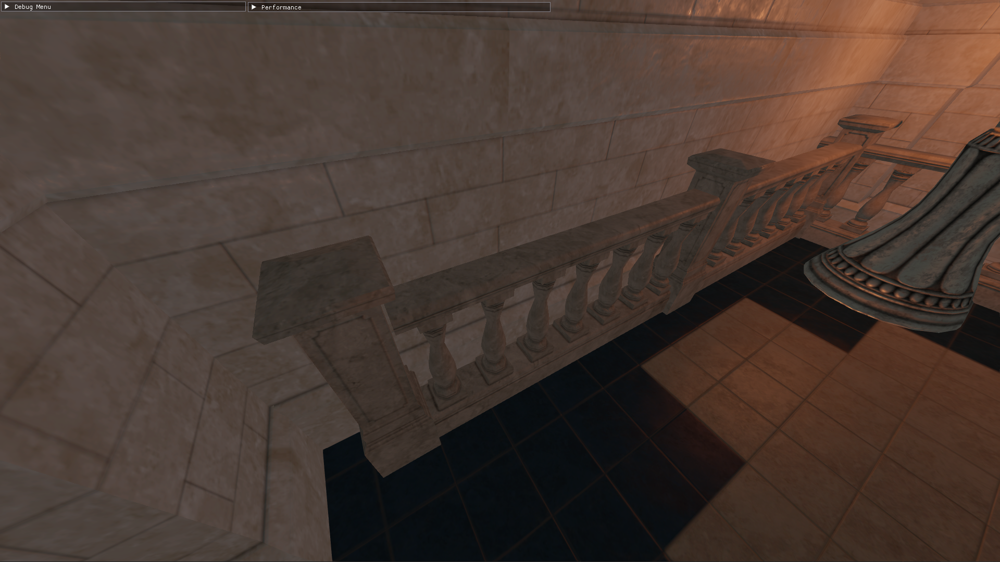
    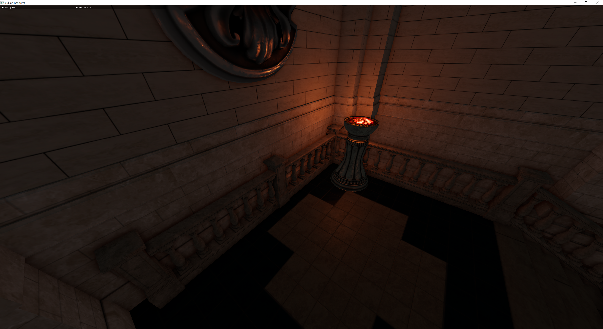
    
Left: SSAO off. Right: SSAO on.

    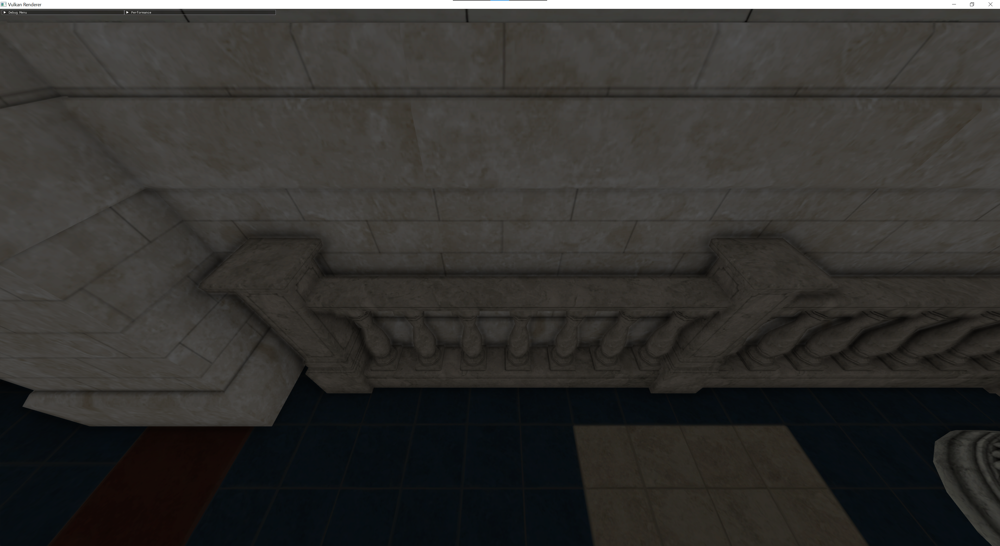
    
    
Left: Normal blur. Right: Bilateral filter.

### Bloom

Bloom is one of the post-processing effects incorporated into the renderer. It is implemented by writing to a 'brightness' render target for bright enough pixels during the shading stage of either forward or deferred. This texture is then blurred using a Gaussian blur the same way as with SSAO blurring, through horizontal and vertical passes. Since multiple blur iterations can be configured to be used to achieve a greater bloom effect, the render target and framebuffer for each iteration and direction (horizontal or vertical pass) is ping-ponged so only 2 buffers ever used for an arbitrary number of iterations.

Afterwards the resulting blurred texture is composited together with the original shaded scene before either being presented or going through further post-processing.

    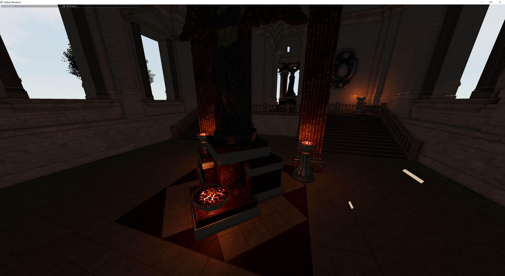
    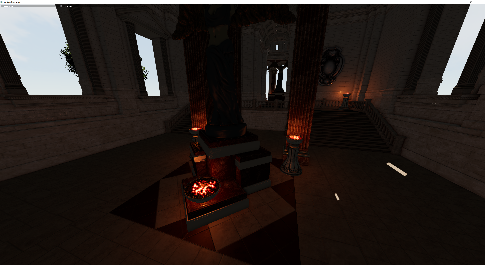
    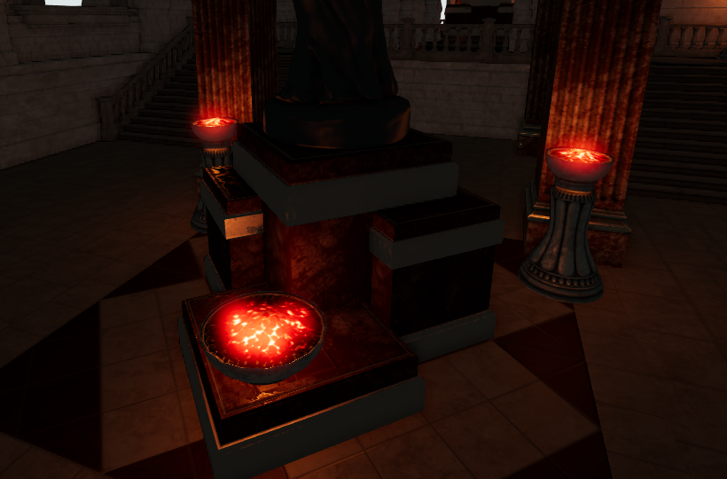
    
1st: Bloom off. 2nd: Bloom on (1 iteration). 3rd: Bloom on (10 iterations).

### Tonemapping

Since rendering is done in HDR due to some features needing HDR computed values (i.e. bloom) a tonemapping stage is needed. This stage is always enabled since we render to an sRGB swapchain image by blitting the final image instead of rendering directly to it in a render pass, and this stage does the sRGB correction as part of it. 

The tonemap stage is currently before any LDR dependent / HDR independent stages (i.e. FXAA or Mosaic) and applies one of the various tonemap functions that are implemented. These tonemapping functions either have sRGB correction built-in or have it applied afterwards.

Tonemapping functions:
- Just gamma: Only applies the sRGB gamma correction with no other colour adjustment.
- [Filmic]((http://filmicworlds.com/blog/filmic-tonemapping-operators/)): Approximation of Digital Fusion Cineon mode by Jim Hejl and Richard Burgess-Dawson.
- [Uncharted]((http://filmicworlds.com/blog/filmic-tonemapping-operators/)): The tonemapping function used in Uncharted 2 by John Hable.
- [ACES](https://github.com/TheRealMJP/BakingLab/blob/master/BakingLab/ACES.hlsl): The ACES tonemapping approximation by Stephen Hill.
- [AgX](https://iolite-engine.com/blog_posts/minimal_agx_implementation): Benjamin Wrensch's approximation of Troy Sobotka's AgX tonemapping function.

At the end of the tonemapping shader, luma is also calculated and stored in the alpha channel of the render target since FXAA could be the next stage if it is enabled, where it is needed as an input.

| Tonemap | Image |
|---|---|
| Just gamma | 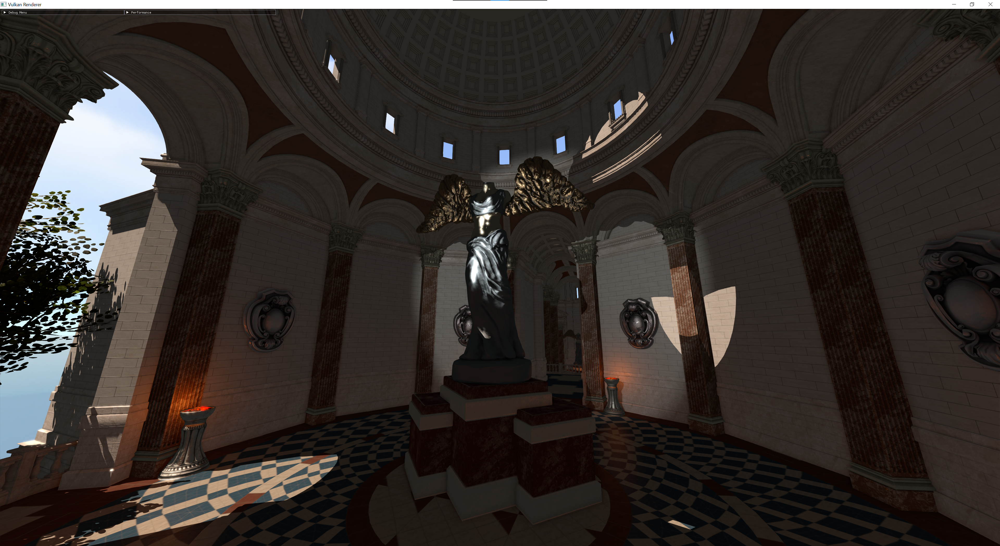 |
| Filmic | 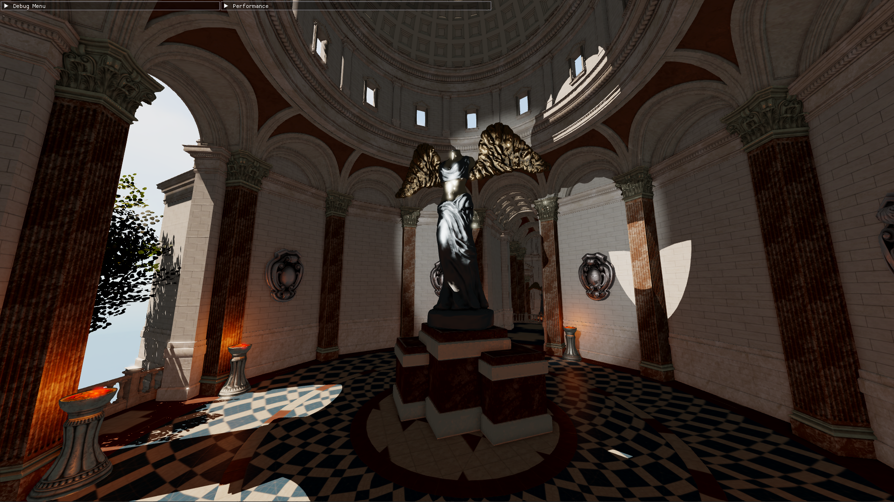 |
| Uncharted | 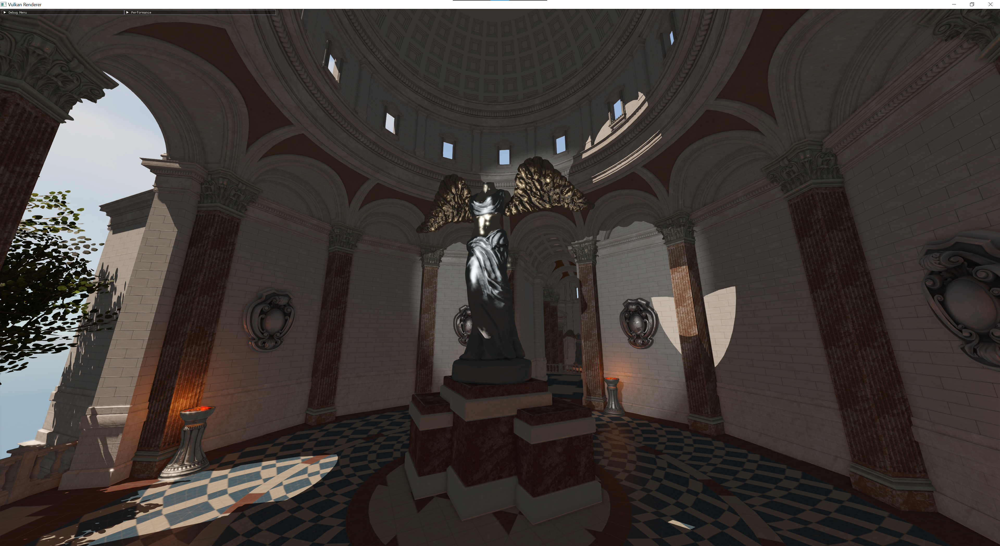 |
| ACES | 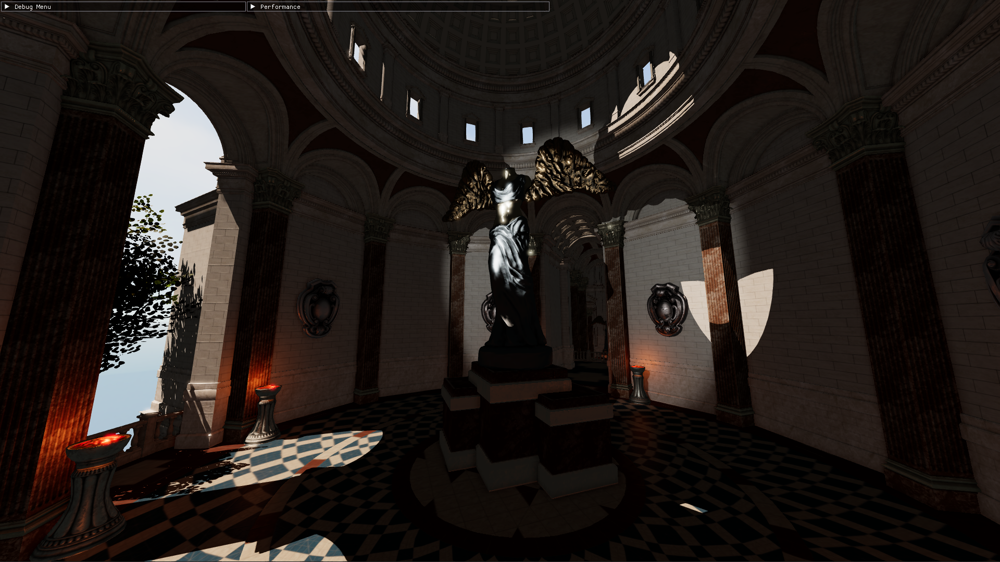 |
| AgX | 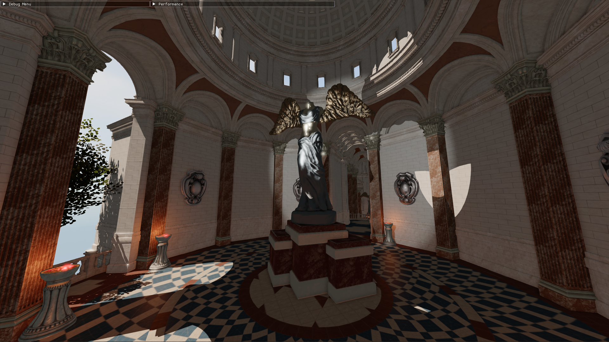 |

### Fast-Approximation Anti-Aliasing (FXAA)

As a quick and efficient anti-aliasing method, FXAA is integrated to provide clean and sharp edges on geometry viewed at non-planar or perpendicular angles, as well as single-pixel light bleeding in geometry such as foliage. The implemented FXAA uses the commonly used `Fxaa3_11.h` shader header file from Timothy Lottes using the highest quality defines for the PC preset: `FXAA_PC 1` and `FXAA_QUALITY__PRESET 39`, the `fxaaQualitySubpix` parameter is also set to `0.0` for the least amount of pixel blurring.

    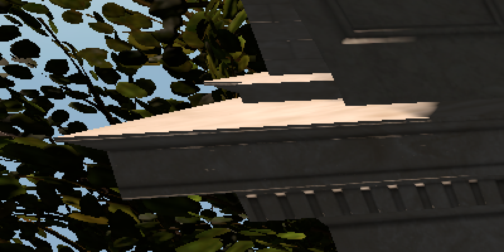
    
    
Left: FXAA off. Right: FXAA on.

### Mosaic

Another post-processing effect that results in giving a 'Mosaic' effect to simulate older-style graphics by essentially reducing the screen resolution by taking a kernel of pixels and using 1 pixel value from that kernel region and using it for the entire kernel. The resolution reduction is essentially a reduction of 5 in the width and a reduction of 3 in the height.

The larger the native resolution the less 'pixellated' or 'mosaic' the final image, but heavy pixellation on larger resolutions start to look quite unappealing, hence the reduction in resolution by a scale factor instead of making the reduced resolution the same for every native resolution.

    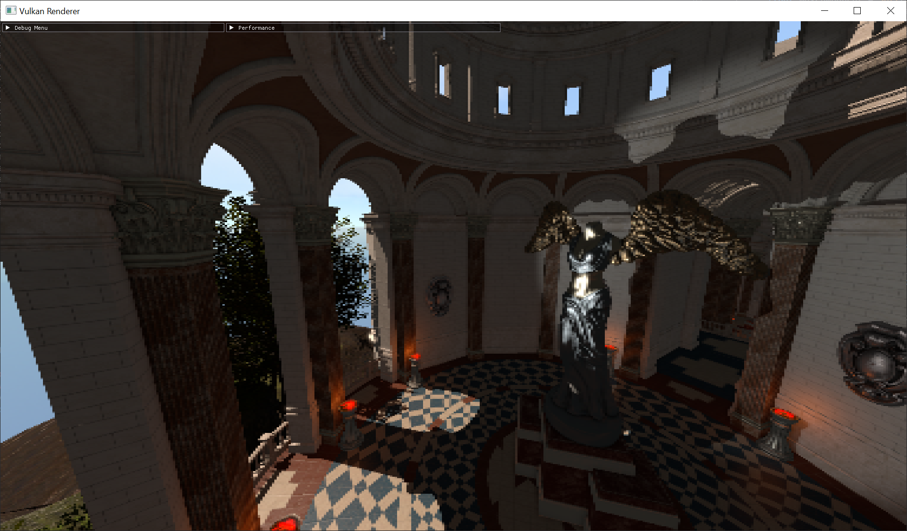
    
    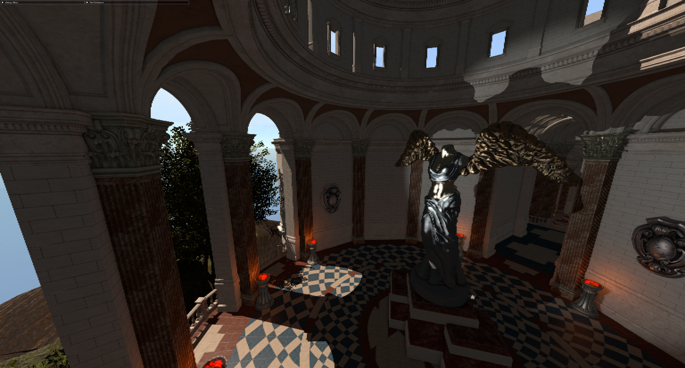
    
1st: Mosaic @ 1920x1080. 2nd: Mosaic @ 2560x1440. 3rd: Mosaic @ 3840x2066.

### Debug

The renderer also provides various debug visualisations to help visualise some values that can help with development or seeing if some aspect of the renderer is being rendered correctly. The list of various debug options and visualisations that can be found are as follows:
- Set presentation mode to one of: Immediate, FIFO, or FIFO Relaxed
- Toggle forward or deferred shading
- Enable / Disable shadows and shadow type (standard or VSM)
- Camera settings (i.e. fov, near and far planes)
- Inspect each shadow map, including each face of cubemapped shadow maps
- Inspect the view of the sun direction
- Number of lights to enable
- Shadow bias and VSM bleed reduction
- Shadow map resolutions
- Sun visualisation settings
- Sun light projection settings
- Adjust depth biases and emissive strength
- Adjust colour and intensity of each light in the scene
- Adjust various settings for some post-processing effects
- Visualise Normals
- Visualise Mipmap level of current fragment
- Visualise Linear depth
- Visualise Overdraw
- Visualise Overshading
- Visualise PBR Distribution function
- Visualise PBR Geometry function
- Visualise PBR Fresnel function

### Debug Visuals

| Debug Setting | Image | Debug Setting | Image |
|---|---|---|---|
| Normals | 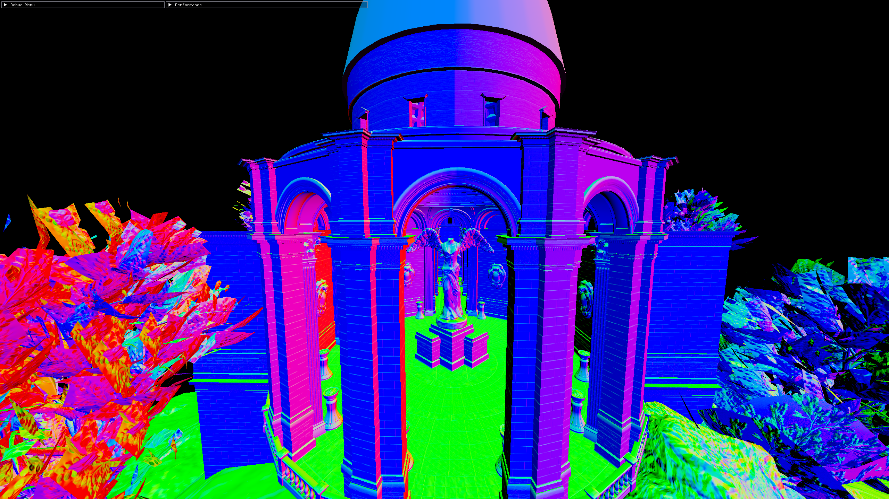 | Mipmap level | 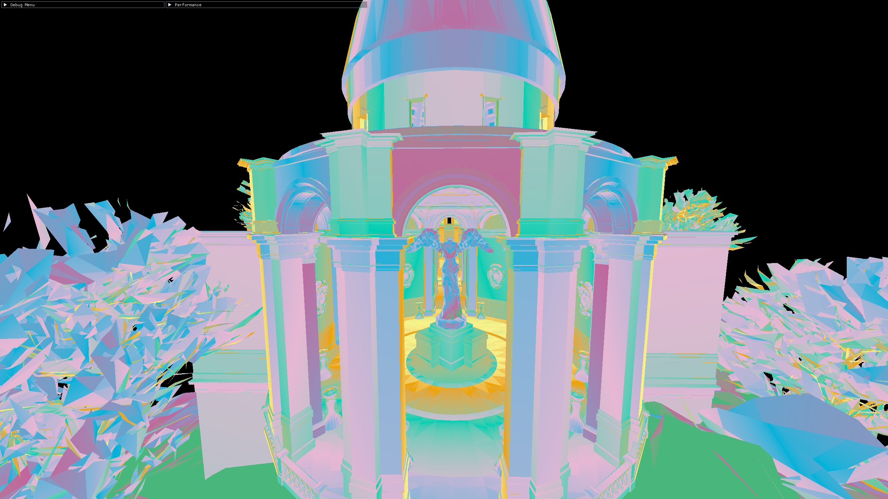 |
| Linear depth | 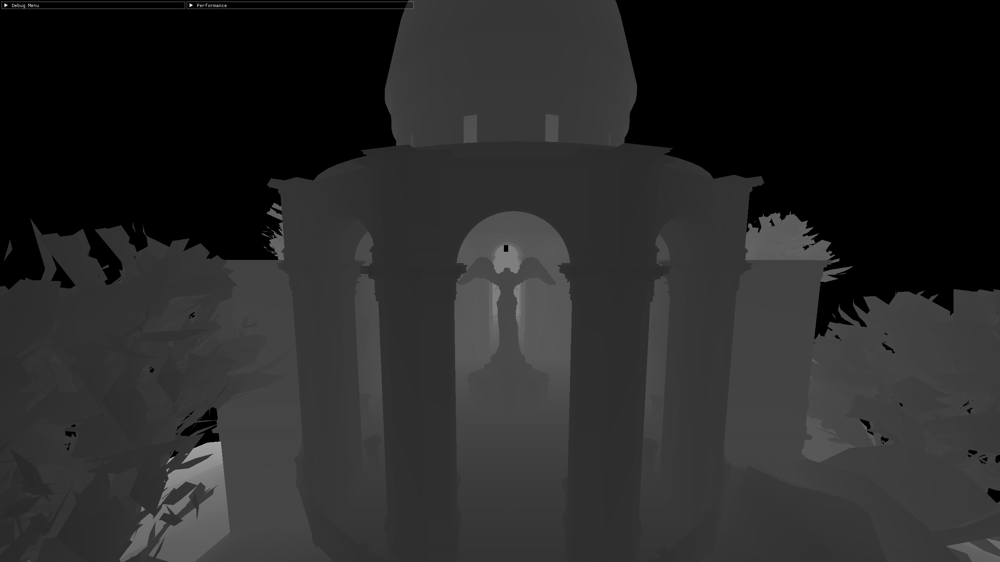 | Overdraw | 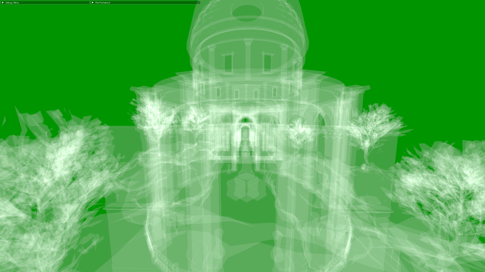 |
| Overshading | 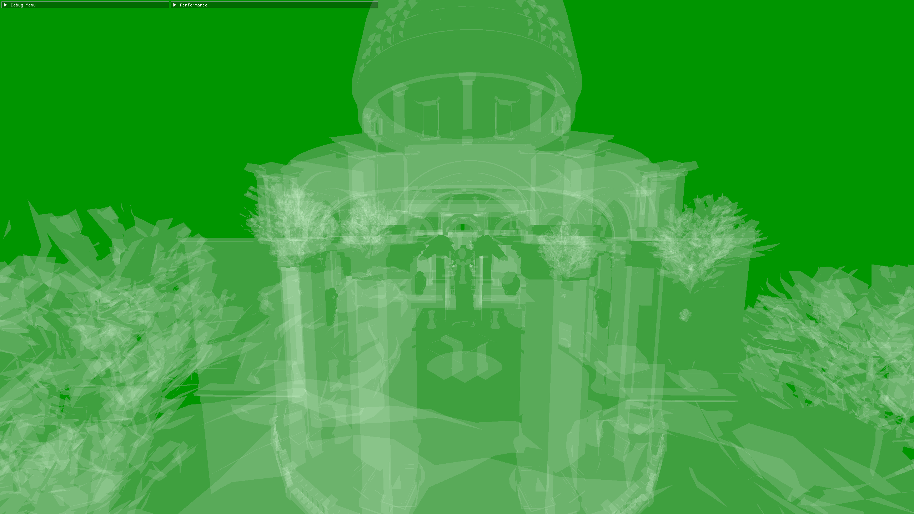 | PBR Distribution | 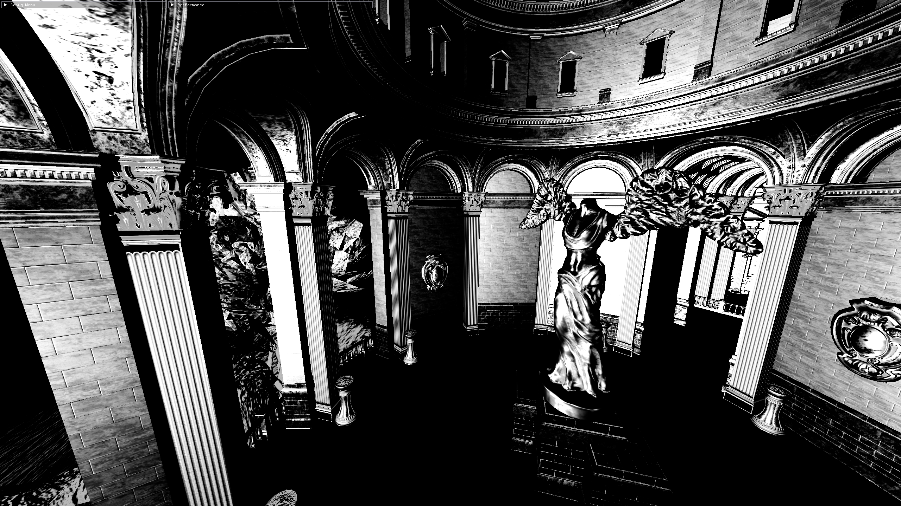 |
| PBR Geometry | 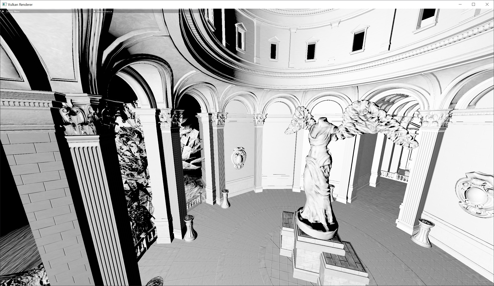 | PBR Fresnel | 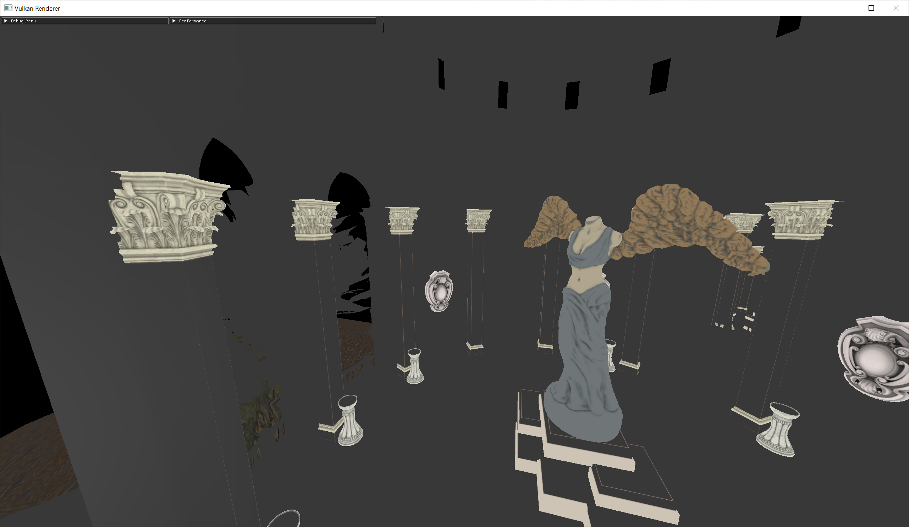 |

### Skybox & Sun

Renders a skybox given the 6 skybox faces to be used as the background for the scene, as well as rendering the sun as a bright point with a smooth gradient falloff around it to simulate the appearance of the sun in the sky, main implementation reason was to be able to see the direction of the sun light in which is accurate to the actual sun light and sun shadow directions.

### Performance Profiling

Uses Vulkan timestamps with a query pool to write and read back timestamps for certain render passes, used to profile the time taken on the GPU to execute these passes in order to identify where the most time is spent on the GPU.

Timestamps are also used on the CPU side using `std::chrono::steady_clock::time_point`s to calculate CPU time taken for parts of the application.

Both CPU and GPU timestamps are wrapped in a `TimestampManager` to easily handle writing timestamps for profiling. The results are then shown in a table in an ImGui window along with a 1s avg for each timestamp taken. (Note: The process of writing and reading back GPU timestamps do incur a fairly large overhead that affects the CPU timings for the frame)

    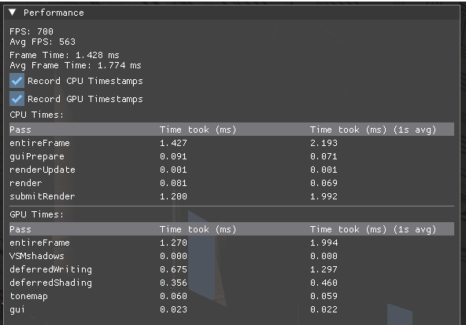
    
(Not everything that happens on the CPU and GPU are recorded in this screenshot, it is only an example)

## Optmisations

There are some optimisations that were used not specific to a certain features implementation. Such as: 

- Only rendering shadow maps when something about it would result in the resulting shadow map changing. Currently all lights are static and there are no dynamic occluders so shadows are usually only rendered once on the first frame, they do get rerendered when their resolution is changed by the user. This is a very big reduction in frame time, but again it is only because of the circumstance of static lights and no dynamic occluders.
- Cache projection and view matrices and mark them dirty when one of their parameters change so only then, the next time they are retrieved they are recalculated. Reducing the number of matrix multiplications with these matrices helps a lot since they are needed every frame.

There are still many optimisations yet to be implemented in the renderer, but since the main goal of this project was to implement various rendering techniques with performance as a secondary goal, not many are yet implemented. Such potential optimisations that I want to get around to implementing are:
- Only updating the GPU sided uniform and shader storage buffers when the actual underlying CPU buffers are changed.
- Reduce number of calls to `vkCmdBindDescriptorSets` by combining descriptor sets where applicable.
- Reduce number of calls to `vkCmdBindPipeline` and try to make each pipeline only bind once to reduce number of pipeline state changes.
- Use frustum culling to reduce number of `vkCmdDraw` commands sent by the CPU when part of the scene is not visible.
- Sort draw calls by material descriptor to, again, reduce number of calls to `vkCmdBindDescriptorSets`.
- Use hardcoded, constant, or uniform values in shaders versus push constants to improve 'uniform flow' within shaders to improve execution speed.
- Potentially use tighter subpass dependencies to allow execution between render passes sooner where possible.
- Light culling for small or confidently non-visible lights since shading many lights, even in deferred, is usually a large portion of frame time.

## Usage

<b>Dependencies</b>
- premake5
- Visual Studio 2022 (or later)

To compile on Windows:

1. Git clone the repository
2. Run `premake5 vs2022` in the root directory where `premake5.lua` is located
3. Open the `VulkanRenderer.sln` file

`main-bake` project must be ran first to bake the custom files and binaries used for loading. Set `main-bake` as startup project in Visual Studio and run in Release mode, do not run in debug mode, it is significantly slower and since it uses Zstd it heavily benefits from compiler optimisations.

After `main-bake` has completed set `main` as startup project and run as normal.
